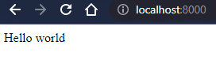
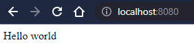

# Отчет по домашнему заданию. Хильченко Михаил Юрьевич.

## Веб-приложение
Веб-приложение, возвращающее один html-файл со строчкой "Hello World". Приложение было написано на языке Java с использованием фреймворка Spring Boot, в \
качестве http-сервера использовался Tomcat, сервер в Spring Boot по умолчанию. Приложение было собрано в jar-файл с использованием сборщика maven.

## Docker
Базовым образом является образ openjdk:8-jdk-alpine. В image сперва создаются пользователь и группа, каждый с идентификатором 1001 и от имени этого пользователя \
создается папка /app в которую добавляется jar-файл приложения. Папка /app назначается рабочей директорией, задается точка входа. Наружу выставляется порт 8000. \
Созданный image называется mikhailkh/webapp:1.0.0

Сборка image (повторная):

```shell
PS D:\java_projects\test-app-web> docker build -t mikhailkh/webapp:1.0.0 .
[+] Building 2.5s (10/10) FINISHED
 => [internal] load build definition from Dockerfile                                                               0.1s
 => => transferring dockerfile: 32B                                                                                0.1s
 => [internal] load .dockerignore                                                                                  0.1s
 => => transferring context: 2B                                                                                    0.1s
 => [internal] load metadata for docker.io/library/openjdk:8-jdk-alpine                                            2.1s
 => [auth] library/openjdk:pull token for registry-1.docker.io                                                     0.0s
 => [internal] load build context                                                                                  0.0s
 => => transferring context: 80B                                                                                   0.0s
 => [1/4] FROM docker.io/library/openjdk:8-jdk-alpine@sha256:94792824df2df33402f201713f932b58cb9de94a0cd524164a0f  0.0s
 => CACHED [2/4] RUN addgroup -S -g 1001 appgroup && adduser --disabled-password -S -u 1001 appuser -G appgroup    0.0s
 => CACHED [3/4] COPY --chown=appuser:appgroup target/*.jar /app/app.jar                                           0.0s
 => CACHED [4/4] WORKDIR /app                                                                                      0.0s
 => exporting to image                                                                                             0.0s
 => => exporting layers                                                                                            0.0s
 => => writing image sha256:0360b6623e67120974cb14d921e37a2511674db641dae95b061635953187eefe                       0.0s
 => => naming to docker.io/mikhailkh/webapp:1.0.0                                                                  0.0s

Use 'docker scan' to run Snyk tests against images to find vulnerabilities and learn how to fix them
```

Создание и запуск контейнера:

```shell
PS D:\java_projects\test-app-web> docker run -ti --rm -p 8000:8000 --name web mikhailkh/webapp:1.0.0

  .   ____          _            __ _ _
 /\\ / ___'_ __ _ _(_)_ __  __ _ \ \ \ \
( ( )\___ | '_ | '_| | '_ \/ _` | \ \ \ \
 \\/  ___)| |_)| | | | | || (_| |  ) ) ) )
  '  |____| .__|_| |_|_| |_\__, | / / / /
 =========|_|==============|___/=/_/_/_/
 :: Spring Boot ::                (v2.7.0)

2022-06-10 17:39:30.422  INFO 1 --- [           main] nexign.bootcamp.demo.TestApplication     : Starting TestApplication v0.0.1-SNAPSHOT using Java 1.8.0_212 on 45e654955c3a with PID 1 (/app/app.jar started by appuser in /app)
2022-06-10 17:39:30.428  INFO 1 --- [           main] nexign.bootcamp.demo.TestApplication     : No active profile set, falling back to 1 default profile: "default"
2022-06-10 17:39:33.023  INFO 1 --- [           main] o.s.b.w.embedded.tomcat.TomcatWebServer  : Tomcat initialized with port(s): 8000 (http)
2022-06-10 17:39:33.083  INFO 1 --- [           main] o.apache.catalina.core.StandardService   : Starting service [Tomcat]
2022-06-10 17:39:33.084  INFO 1 --- [           main] org.apache.catalina.core.StandardEngine  : Starting Servlet engine: [Apache Tomcat/9.0.63]
2022-06-10 17:39:33.388  INFO 1 --- [           main] o.a.c.c.C.[Tomcat].[localhost].[/]       : Initializing Spring embedded WebApplicationContext
2022-06-10 17:39:33.388  INFO 1 --- [           main] w.s.c.ServletWebServerApplicationContext : Root WebApplicationContext: initialization completed in 2844 ms
2022-06-10 17:39:34.515  INFO 1 --- [           main] o.s.b.w.embedded.tomcat.TomcatWebServer  : Tomcat started on port(s): 8000 (http) with context path ''
2022-06-10 17:39:34.539  INFO 1 --- [           main] nexign.bootcamp.demo.TestApplication     : Started TestApplication in 5.312 seconds (JVM running for 7.766)
2022-06-10 17:40:11.482  INFO 1 --- [nio-8000-exec-1] o.a.c.c.C.[Tomcat].[localhost].[/]       : Initializing Spring DispatcherServlet 'dispatcherServlet'
2022-06-10 17:40:11.483  INFO 1 --- [nio-8000-exec-1] o.s.web.servlet.DispatcherServlet        : Initializing Servlet 'dispatcherServlet'
2022-06-10 17:40:11.485  INFO 1 --- [nio-8000-exec-1] o.s.web.servlet.DispatcherServlet        : Completed initialization in 2 ms
```

Результат работы (порт 8000 контейнера связан с портом 8000 хоста):



Ссылка на docker hub: https://hub.docker.com/repository/docker/mikhailkh/webapp

# Kubernetes
Использовался minikube. \
Запуск:
```shell
PS D:\java_projects\test-app-web> minikube stop
✋  Узел "minikube" останавливается ...
🛑  Выключается "minikube" через SSH ...
🛑  Остановлено узлов: 1.
PS D:\java_projects\test-app-web> minikube start --embed-certs
😄  minikube v1.25.2 на Microsoft Windows 10 Pro 10.0.19044 Build 19044
✨  Используется драйвер docker на основе существующего профиля
👍  Запускается control plane узел minikube в кластере minikube
🚜  Скачивается базовый образ ...
🔄  Перезагружается существующий docker container для "minikube" ...
🐳  Подготавливается Kubernetes v1.23.3 на Docker 20.10.12 ...
    ▪ kubelet.housekeeping-interval=5m
🔎  Компоненты Kubernetes проверяются ...
    ▪ Используется образ gcr.io/k8s-minikube/storage-provisioner:v5
🌟  Включенные дополнения: storage-provisioner, default-storageclass
🏄  Готово! kubectl настроен для использования кластера "minikube" и "default" пространства имён по умолчанию
```

Были написаны два манифеста, Pod-manifest по аналогии с примером из лекции, файл pod.yaml и Deployment-manifest с двумя репликами приложения.

Pod-manifest:

```shell
PS D:\java_projects\test-app-web> kubectl apply -f pod.yaml -n default
pod/web created
PS D:\java_projects\test-app-web> kubectl get pods
NAME                              READY   STATUS    RESTARTS   AGE
web                               1/1     Running   0          10s
```

Обеспечение доступа к приложению снаружи

```shell
PS D:\java_projects\test-app-web> kubectl port-forward pods/web 8080:8000
Forwarding from 127.0.0.1:8080 -> 8000
Forwarding from [::1]:8080 -> 8000
Handling connection for 8080
Handling connection for 8080
```

Deployment-manifest:
```shell
PS D:\java_projects\test-app-web> kubectl apply -f deployment.yaml -n default
deployment.apps/web-deployment created
PS D:\java_projects\test-app-web> kubectl get deployments
NAME             READY   UP-TO-DATE   AVAILABLE   AGE
web-deployment   2/2     2            2           3s
```

Обеспечение доступа к приложению снаружи
```shell
PS D:\java_projects\test-app-web> kubectl port-forward deployment/web-deployment 8080:8000
Forwarding from 127.0.0.1:8080 -> 8000
Forwarding from [::1]:8080 -> 8000
Handling connection for 8080
Handling connection for 8080
```

Результат работы, теперь у хоста порт 8080:

